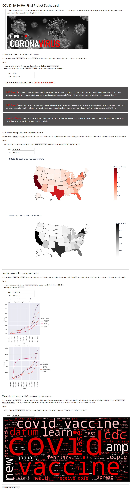

# MACS30122 Final Project - COVID-19 Data and CDC's Tweets Analysis

final-project-covid-twitter created by GitHub Classroom

**This repository is for final project for course MACS 30122.**

**Team name**: covid-twitter

**Team member**: Jinfei Zhu, Xi Cheng, Boya Fu, Yile Chen

**GitHub Repository**: https://github.com/cs-ssa-w21/final-project-covid-twitter

**Goals**: 2020 is all about Covid-19. This unprecedented global pandemic has changed everyone's daily normal and we are willing to find out what CDC news relates to the change of the number of covid infected persons and death. In the meantime, in the United States, many governors like Andrew Cuomo of New York State gives covid administration on Twitter. We would also collect data from several states seriously influenced by Covid. If time permits, we would collect data from all states' governors. We would build a web interaction page (probably using flask) that when users input a time period and state name, they can see the covid number and CDC & governors policy guidelines and covid-related policies.

Our analysis contains five parts:
- Data Collection (Jinfei Zhu)
- COVID Data Analysis (Jinfei Zhu)
- CDC Tweets Word and Phrase Frequency Analysis (Xi Cheng)
- Record Linkage (Boya Fu)
- Visualization and Interactive Dashboard (Yile Chen)

# Prerequisites

Run following command in Anaconda Prompt (windows) or terminal window (MacOS or Linux):

Update Anaconda and Jupyter Notebook to latest version:

```
conda update conda
conda update anaconda
conda update jupyter
```


Following packages needs to be downloaded to successfully run all notebooks for this project:

[twint 2.1.20](https://pypi.org/project/twint/): Download Tweets

`pip install twint`

[Plotly 4.14.3](https://pypi.org/project/plotly/): Draw US map

`pip install plotly`

[nbformat 5.1.2](https://pypi.org/project/nbformat/) : To successfully run plotly

`pip install nbformat`

[tweet-preprocessor 0.0.6](https://pypi.org/project/tweet-preprocessor/): To preprocess Tweets

`pip install tweet-preprocessor`

[nltk 3.5](https://pypi.org/project/nltk/): To analyze Tweets

`pip install nltk`

[spacy 3.0.5](https://pypi.org/project/spacy/): To analyze Tweets

`pip install spacy`

[wordcloud 1.8.1](https://pypi.org/project/wordcloud/): To draw wordcloud

`pip install wordcloud`

[matplotlib 3.3.4](https://pypi.org/project/matplotlib/): To draw plots

`pip install matplotlib`

[Keras 2.4.3](https://pypi.org/project/Keras/): To analyze Tweets

`pip install Keras`

[Voila 0.2.7](https://voila.readthedocs.io/en/stable/using.html): To build Dash Board

`pip install voila`

[ipywidgets 7.6.3](https://pypi.org/project/ipywidgets/): To creat interactive visualization

`pip install ipywidgets`

# How to use our dashboard

To use Voilà within a pre-existing Jupyter server, first start the server, then go to the following URL:

`<url-of-my-server>/voila`

For example, if you typed jupyter notebook and it was running at `http://localhost:8888/tree`, then Voilà would be accessed at `http://localhost:8888/voila`.

In this case, Voilà will serve the directory in which the Jupyter server was started.

*please run 2_COVID_Tweets_word_frequency_analysis.ipynb before you run the dashboard. Since preprocessed tweets are stored with it and is called as stored value in the dashboard to save running time.

# What does our Dashboard look like



# Data Source

## Twitter

CDC: https://twitter.com/CDCgov


Governors' Tweets: 

We have collected Twitter from 51 governor's Twitter. Their handle are in `data\governor-twitter-handle.csv`. Here are some examples:

Illinois Governor JB Pritzker: https://twitter.com/GovPritzker

New York Governor Andrew Cuomo: https://twitter.com/NYGovCuomo

## Covid Data

JHU COVID MAP: https://coronavirus.jhu.edu/map.html

# Files in this repository

## Main repository

`1_Data_collection_and_covid19_data_analysis.ipynb`: The notebook for data collection and covid data analysis

`2_COVID_Tweets_word_frequency_analysis.ipynb`: The notebook for Tweets analysis

`3_Record_linkage.ipynb`: The notebook for record linkage

`4_Dashboard.ipynb`: The interactive dashboard notebook

`scrape_twitter_with_Twint.py`: Python functions to scrape twitter with Twint

`covid_data_analysis.py`: Python functions to do COVID data cleaning, analysis, and visualization

`Record_linkage_helper.py`: Python functions for record linkage

`README.md`: This file

## sqlcode

`covid-big-query-by-country.sql` and `covid-big-query-by-state.sql`: SQL scripts to retrieve COVID data from Google Bigquery platform

## data

`covid-data-by-state.csv`: COVID data by states from 2020-01-01 to 2021-02-22, including confirmed and deathes

`covid-data-US.csv`: COVID data of the US from 2020-01-01 to 2021-02-22, including confirmed and deathes

`governor-twitter-handle.csv`: Specific Twitter handles for each governor

`cdc_twitter_covid.json`: All CDC Tweets that mention the term 'COVID'

`cdc_twitter_since_2020.json`: All CDC Tweets from 2020-01-01 to 2021-02-22

`merged_df_final`: Output of record linkage

`tweet.csv` and `tweet.txt`: Cleaned Tweets

`Sample_output_rl.png`: A image for the sample output of record linkage

`governor` folder: This folder contains json files documenting all Tweets that mention the term 'COVID' in each governor's Twitter

`test` folder: A folder to store some test scraping results when running code (you can safely ignore it)

# References

## Data Collection

*Twint Package*

Pakage Introduction: 

    https://github.com/twintproject/twint
    
Configuration Options: 

    https://github.com/twintproject/twint/wiki/Configuration

*Other information*

Debugging: 

    https://github.com/twintproject/twint/issues/1121#issuecomment-773521415
    

## COVID Data Analysis

Regex in pandas: 

    https://kanoki.org/2019/11/12/how-to-use-regex-in-pandas/
    
Seaborn: 

    https://seaborn.pydata.org/generated/seaborn.FacetGrid.html
    
    https://seaborn.pydata.org/generated/seaborn.relplot.html
    
plotly: 

    https://plotly.com/python/choropleth-maps/
    
Constructing a python package with different files (though we finally didn't construct the package because kernel died after we added __init__.py file for unknown reason):

    https://python-102.readthedocs.io/en/latest/packaging.html
    
    
## Tweets Analysis

Tweet preprocessing: 

    https://pypi.org/project/tweet-preprocessor/

Spacy:

    https://spacy.io/
    
NLTK:
    
    https://www.nltk.org/
    
Wordcloud:

    https://amueller.github.io/word_cloud/
    
Keras:

    https://pypi.org/project/Keras/
    
## Dashboard interaction

Voila:
    
    https://voila.readthedocs.io/en/stable/using.html

ipywidgets:

    https://ipywidgets.readthedocs.io/en/latest/examples/Using%20Interact.html
    https://www.youtube.com/watch?v=FngV4VdYrkA

    
